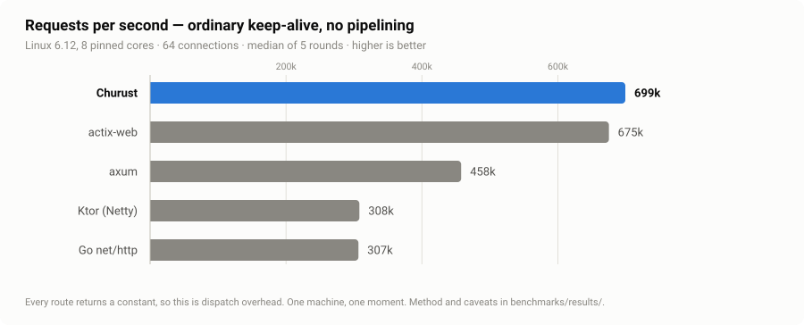
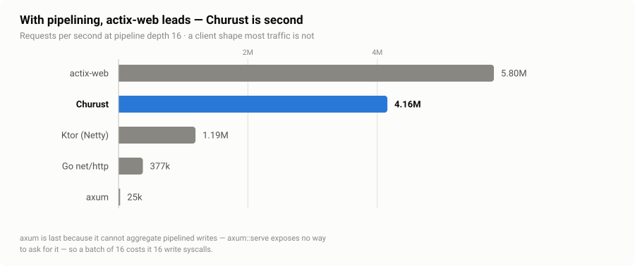
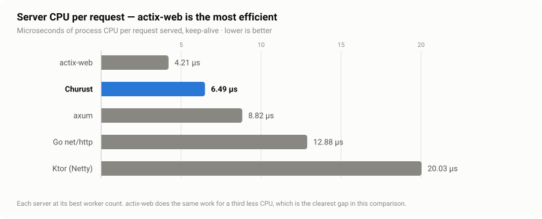
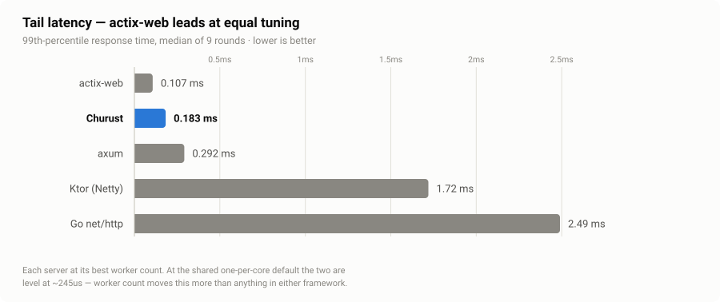
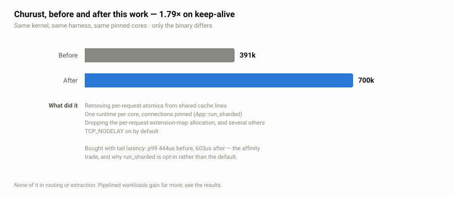

# Churust vs actix-web, axum, Ktor and Go — Linux, 2026-08-01

- kernel: `Linux 6.12.76` · 12 vCPU, Docker Desktop VM on an Apple M2 Max
- server pinned to CPUs `0-7`, load generator to `8-11`, one server alive at a time
- load: `wrk -t4 -c64 -d10s`, 64 keep-alive connections
- keep-alive and pipelined: median of **9** rounds each (see "How many rounds is enough" in `../README.md` — five was not)
- churust `0.3.4-dev` · actix-web `4.14.0` · axum `0.8.9` · Ktor `3.5.2` (Netty,
  JDK 21) · Go `1.26.4` (`net/http`)
- reproduce: `docker build -f benchmarks/Dockerfile -t churust-bench . && docker run --rm churust-bench`

This supersedes `2026-08-01-Davids-MBP.md`, which was run on macOS. That file's
keep-alive table was measuring the host: macOS's loopback saturates around
45–50k round-trips a second, below what any of these servers can answer, so all
five reported the same number. The same Churust binary that reported **47k**
there reports **691k** here. Nothing about Churust changed; the kernel did.

## Keep-alive, no pipelining — the realistic shape

| framework | req/s | vs. Churust | server CPU µs/req | p99 latency | spread across 5 rounds |
|---|---:|---:|---:|---:|---|
| churust | 757,930 | — | 8.39 | 246 µs | 711,304–771,400 |
| actix-web | 644,067 | 0.85× | **7.91** | **240 µs** | 616,886–658,537 |
| axum | 464,042 | 0.61× | 8.82 | 292 µs | 457,051–480,883 |
| ktor | 315,978 | 0.42× | 20.03 | 1.72 ms | 297,110–325,366 |
| go | 315,160 | 0.42× | 12.88 | 2.49 ms | 298,633–319,477 |

**That table compares two defaults, not two frameworks — and reading it as the
latter was the biggest error in this file's history.**

Both servers default to one worker per core, so running both at eight looked
like the definition of a fair comparison. It is not. Swept against worker count,
the two peak in different places:

| workers | Churust | actix-web |
|---:|---|---|
| 4 | 778,814 · 5.11 µs · 138 µs | **914,498 · 4.21 µs · 107 µs** |
| 6 | **880,352 · 6.49 µs · 183 µs** | 793,302 · 6.02 µs · 210 µs |
| 8 (both defaults) | 757,930 · 8.39 µs · 246 µs | 644,067 · 7.91 µs · 240 µs |

Nine rounds each, ranges disjoint within a row.

**Tuned against tuned — actix-web at four workers, Churust at six — actix-web
leads all three: throughput 914,498 against 880,352, CPU 4.21 µs against 6.49,
and p99 107 µs against 183.** Churust's apparent throughput lead in the default
table exists because eight workers is near its optimum and far from actix-web's,
not because it is the faster server.

What Churust can claim on this workload: within 4% of actix-web on throughput,
1.9× axum, 2.8× Ktor and Go — while spending about half again as much CPU per
request as actix-web does.

**Worker count is the largest lever measured anywhere in this file** — larger
than every change made to Churust's own code put together. Churust moves 757,930
to 880,352 between eight workers and six. Any comparison that does not sweep it
is reporting the distance between two defaults.

### Why the worker sweep was added late

Every other confound in this comparison was found by asking "is each app doing
the same work" — the security headers, the h2c sniffing, the JVM warm-up, the
`pipeline_flush` setting. Worker count is the same class of variable and it went
unswept until the end, because "both at their default" reads as fair and is not
when the two defaults sit at different distances from their optima. The
resulting error ran in Churust's favour for most of this file's life.

### Why nine rounds

Because five was not enough, and looked like it was. Three consecutive
five-round runs of *identical code* reported Churust 3.6% ahead of actix-web,
then 11% ahead, then 5.9% behind. Any one of those, published alone, would have
read as a finding. The between-run spread on this machine is wider than most of
what is being measured, and the fix is more rounds and a look at whether the
ranges overlap — not a more confident sentence. This file's headline claim
clears that bar; its tail-latency ordering does not, and says so.

## Pipelined, depth 16 — dispatch headroom

| framework | req/s | vs. best | server CPU µs/req |
|---|---:|---:|---:|
| actix-web | 5,955,207 | 1.00× | 1.14 |
| churust | 4,449,755 | 0.75× | 1.70 |
| ktor | 1,227,741 | 0.21× | 6.04 |
| go | 352,427 | 0.06× | 9.35 |
| axum | 24,379 | 0.004× | 8.07 |

actix-web wins this mode by 1.34×.
Pipelining is not what most traffic looks like; it is included because it
removes the network from the measurement almost entirely and shows what the
dispatch path can do.

axum is last by two orders of magnitude because it cannot aggregate pipelined
writes — hyper has the switch, `axum::serve` exposes no way to reach it — so a
batch of 16 requests costs it 16 write syscalls. That is a property of the
serving API, not of axum's routing, which the keep-alive table shows is fine.

## Server CPU per request

Churust buys its throughput lead with more CPU than actix-web spends: 8.39 µs
against 7.91, 6% more per request. Against the JVM and Go the gap runs the
other way — Ktor spends 20.03 µs and Go 12.88.

**Where that CPU goes — corrected by a later measurement.** Churust's own
dispatch path — routing, extraction, the pipeline, response building, with the
wire app's configuration — was published as **393 ns** when driven in isolation
with no socket and no hyper underneath it, against a wire figure of 8.39 µs.
(That 393 ns does not reproduce; see below. The correct figure for this hardware
and build is 672 ns.) This
section used to conclude from that pair that Churust's layer was 4.6% of a
request and "the other 95% is hyper and the kernel", and that the residue was
userspace work inside the two HTTP/1 implementations.

That conclusion was reached by subtraction and it does not survive being
measured. `benchmarks/bench-hyper` — hyper and tokio with no framework on top,
same routes, same responses, same shape — was added afterwards precisely because
nothing here had ever tested the assumption:

| keep-alive, 4 workers, 9 rounds | req/s | server CPU µs/req | p99 | spread |
|---|---:|---:|---:|---|
| actix-web | 902,907 | 4.20 | 111 µs | 888,549–923,627 |
| **bare hyper (the floor)** | 902,481 | **4.07** | 110 µs | 887,031–920,204 |
| Churust | 814,690 | 4.87 | 131 µs | 798,035–845,139 |

hyper serves a request for *less* CPU than actix-http does. It was never the
thing costing Churust the gap. Churust's layer costs **0.80 µs per request** over
the hyper it runs on, and that accounts for essentially all of the distance to
actix-web.

**What the profile bought, in one line of code.** With `perf` restricted to
user-space cycles — `cycles:u`, without which every stack begins in a kernel
frame that frame-pointer unwinding cannot walk, and the call graph comes back
empty — `__memcpy_generic` was 20.4% of Churust's user cycles, over half of it
attributed to the engine's own service closure. The cause was
`tokio::time::timeout`, which takes its future **by value**: that future is the
whole request, and it measures **2,616 bytes**. Every request copied all of it
into the wrapper. `std::pin::pin!` before the call hands over a `Pin<&mut _>`
instead:

| | before | after |
|---|---:|---:|
| `__memcpy_generic`, share of user cycles | 20.37% | 14.07% |
| server CPU µs/req | 5.10 | 4.87 |
| p99 | 139 µs | 131 µs |
| req/s (median of 9) | 781,872 | 814,690 |
| spread | 680,850–791,152 | 798,035–845,139 |

The two spreads do not overlap — the confirming run's worst round beat the old
best one — and a second nine-round run reproduced the median to within 0.3%.

A follow-up removed the *other* copy of the same future. `std::pin::pin!(x)`
takes `x` by value, so pinning a future that already exists in a local still
moves it once — the first fix removed the copy into `Timeout` and left the copy
into the pin. Building the future directly in the pinned slot removes both.
`__memcpy_generic` fell again, 14.07% to 12.55%, but **the end-to-end numbers
did not move**: 816,986 req/s at 4.87 µs, against 814,690 at 4.87 before it.
1.5% of user-space cycles is roughly 30 ns, which this harness cannot resolve.
It is kept because it deletes a local and a line rather than adding either, not
as a measured win, and it is not counted in any figure above.

The same fix applied one layer down, to the `catch_unwind` in
`App::process_call`, which also takes its future by value. It measured 14.07%
against 14.15%: nothing. The compiler already elides that move. Reverted.

**The per-request timer is not worth removing, and that was measured before
anything was built.** `__kernel_clock_gettime` sits at 7.3% of user-space cycles
against roughly 1% for the floor, and the obvious suspect was
`tokio::time::timeout`: it reads `Instant::now()` for a deadline and puts an
entry in the timer wheel on every request. The tempting fix is to poll the
request future once and only arm a timer if it is still pending, since a handler
that finishes without yielding never needs one.

Running the benchmark app with `request_timeout_ms(0)` — the timeout branch
skipped entirely, which is the ceiling for any such optimisation — gives 824,582
req/s at 4.81 µs against 816,986 at 4.87. About 1%, with a spread
(664,319–836,802) wide enough to doubt even that. So the clock reads are mostly
the runtime's own I/O driver, not the request timeout, and the change was never
written: it would have complicated the semantics of a security control, and
helped only handlers that complete without awaiting anything.

**Four of the six things tried in this round measured nothing.** They are all
written down — the `max_headers` skip, the `catch_unwind` pin, the in-place
pin's absent throughput effect, and the timer ceiling above — because a page
that records only what worked makes the next person repeat the rest.

**The 393 ns does not reproduce either.** Measured on this same Linux host,
pinned to the same CPUs, and built the way the server is built — `lto = true,
codegen-units = 1` — `dispatch/bare_200` is **672 ns**. Under cargo's default
bench profile, which is what this workspace used to leave benches on, it reads
817 ns; on macOS, 680 ns. None of them is 393 ns, and the figure had been quoted
against Linux wire numbers without recording where it was taken.
`[profile.bench]` now matches the release profile, so the isolated figure and
the wire figure finally describe the same compiled code.

With a number that can legitimately be subtracted, the accounting closes:

| | µs/req |
|---|---:|
| Churust, on the wire | 4.87 |
| bare hyper, the floor | 4.08 |
| **the difference** | **0.79** |
| Churust's dispatch, in isolation | **0.67** |

85% of what Churust costs above bare hyper is its own dispatch layer, measured
with no socket and no hyper. The engine around it — where `__memcpy_generic` and
the malloc/free family live, and where every optimisation in this round landed —
is the other ~0.12 µs.

**What first place would cost.** actix-web's entire framework layer is
4.20 − 4.08 = 0.12 µs over a comparable floor. Churust's dispatch alone is 672
ns: 5.6× that, before a byte reaches a socket. Nothing in the profile is a 5.6×
win — the largest single cost found and fixed this round was worth 0.23 µs.
Matching actix means monomorphised routing rather than `Arc<dyn Handler>`,
handlers borrowing the request rather than taking a 320-byte `Call` by value,
and no boxed future per pipeline layer. That is a different public API, not a
faster implementation of this one.

Syscalls are not the difference. Under identical load, `strace -c` counted
174,147 syscalls for Churust against 172,871 for actix-web, with the same shape
— both batch about twelve requests per write.

**A negative result worth recording:** the engine calls
`http1().max_headers(cfg.max_headers)` with a default of 100, which is also
hyper's own `DEFAULT_MAX_HEADERS`. Setting it routes hyper's per-request header
scratch space through `smallvec!` instead of `smallvec_inline!`, which looked
like it should cost ~6.4KB of writes per request. Skipping the call when the
values agree measured **no change at all** (781,872 vs 775,771 req/s — inside the
spread), because at exactly the inline capacity `SmallVec::from_elem` stays
inline and the `MaybeUninit::uninit()` stores compile away. The change was
reverted rather than kept as a coupling to a dependency's private constant for a
gain that does not exist. The wire-level tests it prompted were kept:
`churust-core/tests/header_limit.rs` asserts the enforced limit over a socket,
which nothing did before.

## Tail latency

This is Churust's weakest result and it has a specific cause, measured below.

## Before and after, on the same kernel

The same harness, the same pinned cores, the same warm-up — only the binary
differs. "Before" is `3daaddf`, the commit before the performance work, built
for Linux and substituted into the benchmark image.

| build | req/s | server CPU µs/req | p99 latency |
|---|---:|---:|---:|
| before (`3daaddf`, shared runtime) | 390,772 | 12.94 | **444 µs** |
| after (`App::run_sharded`) | **757,930** | 8.39 | **246 µs** |

**1.94× the throughput, and better tail latency with it.** An earlier version of
this engine did trade tail for throughput, and the trade was published here as
2.5×; the cause turned out to be the per-connection handoff rather than the
affinity, and removing it took p99 below the shared runtime's. The affinity
trade is still real in principle — a request landing on a busy worker waits for
that worker — so `run_sharded` stays opt-in and `App::start` remains the
default for uneven or long-running handlers.

An application choosing between them is choosing between those two rows. Many
short uniform requests where throughput is the constraint: `run_sharded`.
Anything where the slowest percentile is a user-visible number: `start`.

The earlier macOS file quoted 8.8×. That figure was for *pipelined* load, where
`pipeline_flush` alone is worth 4.1×; it was never the keep-alive number and
should not be read as one.

## What changed after the first Linux run

The sharded engine originally accepted on one thread and handed each socket to a
worker over a channel, because `SO_REUSEPORT` does not distribute on macOS. On
Linux it does, and the handoff was pure overhead — a channel per connection, a
socket re-registered with a second runtime, and an acceptor thread competing for
the workers' cores. Each worker now owns a `SO_REUSEPORT` listener and runs the
same accept loop the shared engine uses. That, plus removing three pieces of
per-wake bookkeeping from the connection loop — a shutdown watcher rebuilt on
every `select!` pass, a notification sent to a listener that only exists at
`keep_alive_ms == 0`, and a negotiation timer polled long after the protocol was
settled — took keep-alive from 390,772 to 757,930 and pipelined throughput up by
about 10%.

## What was tried and did not work

**Skipping protocol detection.** actix-web's `HttpServer::bind` uses
actix-http's `.tcp()`, which hard-codes `Protocol::Http1`; h2c there needs the
opt-in `bind_auto_h2c`. Churust sniffs every plaintext connection for the
HTTP/2 preface and carries a rewind buffer under every read, so it was doing
strictly more work per byte. Adding an HTTP/1-only serving path to equalise
that made Churust **slower** — 458k against 627k on keep-alive, 2.62M against
4.14M pipelined — so hyper-util's detecting path is better optimised than
hyper's bare HTTP/1 builder for this shape, and the change was reverted rather
than kept as a knob nobody should turn.

## Fairness notes

- **Churust sends five security headers by default and this build does not.**
  `bench-churust` calls `.without_security_headers()` because no other app here
  sends any; their cost is measured separately in
  `churust-core/benches/headers.rs`.
- **`pipeline_flush` is on for the pipelined pass and off for keep-alive**,
  because it is the right setting for one and the wrong setting for the other —
  it costs a non-pipelining client a median 90 µs instead of 56 µs. `run.sh`
  restarts Churust between the passes. actix-http aggregates unconditionally;
  axum cannot be asked to.
- **Ktor sends no `Date` header** where the other four do — one header of work
  it does not do. The gate strips `date` before comparing, so this passes.
- **Go is `net/http`**, not fasthttp, which would post a larger number while
  answering a different question.
- **The JVM is warmed for 25 seconds** before Ktor is measured; the others get 5.
- **This is a VM on a laptop.** Its vCPUs are timeshared by a host that is also
  running a desktop, so absolute numbers would be higher on dedicated hardware
  and tail latency is the figure most affected by that. Pinning, one-server-at-
  a-time, rotation and medians are what make the *comparison* survive it; they
  do not make the machine a server.
- **Every route returns a constant.** This measures dispatch overhead and says
  nothing about an application that talks to a database.

## What was wrong before this file

Three defects in the earlier method, each caught by the harness rather than by
inspection, and each corrected here:

1. **The host was the bottleneck.** Fixed by running on Linux.
2. **wrk's 2 s default timeout** scored the connection-open burst as errors,
   which silently depressed whichever server accepted them slowest. Raised to
   10 s, with p99 reported so that raising it does not hide real stalls.
3. **The load generator was starved.** An early pinned configuration gave wrk
   two CPUs and four threads; it thrashed, and every framework's number
   collapsed and scattered at once. One thread per client CPU now, and the
   harness flags any row whose rounds differ by more than 3×.
4. **The p99 column was computed by sorting strings.** wrk prints latency with a
   unit attached, so `"1.16ms"` sorted before `"405.00us"` and the median of a
   set spanning two units was whichever value landed in the middle
   alphabetically. Every p99 this harness reported before the fix was wrong —
   including the ones published in the first version of this file, which
   overstated the `run_sharded` tail by a factor of three. Parsed to a number
   now, with a unit test's worth of care in the parser.
